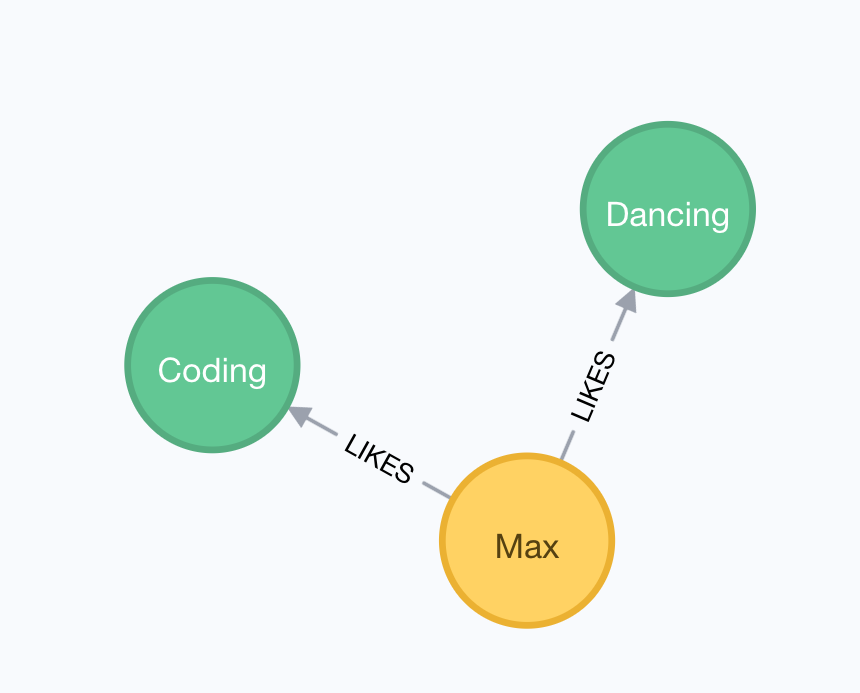

== Data Stores

Damit die Daten der Anwendung auch über einen Neustart hinweg erreichbar sind, ist es unabdingbar, dass ein Data Store verwendet wird.
In diesem Kapitel wird der Unterschied verschiedener Datenbanken aufgezeigt und der Zugriff auf diese auf unterschiedlichen Abstraktionsebenen.

NOTE: Der kommende Vergleich zwischen SQL und NoSQL ist nur eine Übersicht und deshalb stark vereinfacht.
Es existieren sowohl in der SQL als auch der NoSQL Welt Funktionalität, die man vor allem in der jeweilig anderen Welt antrifft.
Bspw. Schema-Zwang bei NoSQL Datenbanken.

=== SQL Datenbanken

SQL Datenbanken, auch _relational database management system_ (RDBMS) genannt, sind tabellenbasierte Datenbanken.
Die Bedeutung von _relational_ betrifft nicht die Verknüpfung von mehreren Tabellen, sondern wird als Beziehung der Daten innerhalb einer Tablle gesehen.

Vor allem zwei Kernpunkte zeichnen SQL Datenbanken aus:

* Festes Schema
+
Die Tabellen haben eine vordefinierte Struktur, die zwar nachträglich angepasst werden kann, aber alle Datensätze müssen dieses Schema einhalten.
Dies betrifft vor allem

** Anzahl der Spalten
** Spaltentyp
** Bedingungen/Constraints (z.B. uniqueness, not-null)

* SQL (Structured Query Language) als Abfragesprache
+
Alle Datenbanken unterstützen den gleichen Syntax.
Für "einfache" Operationen ist diese Aussage korrekt, es gibt jedoch herstellerspezifische Funktionen oder Eigenheiten, die zu beachten sind (bspw. Datumshandling).

Bekannte Anbieter im RDBMS Bereich sind u.a. Oracle, MySQL, Postgres, Microsoft SQL Server, aber auch leichtgewichtige Lösungen, wie z.B. SQLite.

==== Beispiel Datensatz

.User table
|===
|id|numeric
|firstName|string
|lastName|string
|age|numeric
|===

.Hobby table
|===
|id|numeric
|type|string
|===

.User to Hobby table
|===
|userId|numeric
|hobbyId|numeric
|===

==== SQL Abfragen

===== SELECT
Eine einfache Abfrage auf den Benutzterdatensatz könnte wie folgt aussehen.

[source,sql]
SELECT * FROM USER

Dieses würde alle Benutzereinträge mit allen Feldern der Tabelle aus der Datenbank zurückgeben.
Soll nur eine Untermenge an Feldern ausgelesen werden, so kann dies schon serverseitig geschehen.

[source,sql]
SELECT firstName, lastName FROM USER

Dieses Statement gibt nur die Vornamen und Nachnamen aller Benutzer zurück.

===== WHERE
Soll die Menge der Einträge im Resultat eingegrenzt werden, wird das Schlüsselwort `WHERE` verwendet.

[source,sql]
SELECT * FROM USER WHERE AGE > 21

Diese einfache Abfrage würde nun nur die Benutzer erfassen, die ein älter als 21 sind.

Die Eingrenzung kann zusätlich beliebig mit oder (`OR`) oder und (`AND`) erweitert werden.
[source,sql]
SELECT * FROM USER WHERE AGE > 21 OR (firstName = 'Max' AND lastName = 'Mustermann')

Hier werden, wie im vorausgegangenen Beispiel, alle Benutzer älter als 21 oder aber alle die `Max Mustermann` heißen selektiert.

===== ORDER BY
Es bietet sich manchmal an, die Datensätze schon auf der Datenbankebene und nicht erst in der Applikation vorzusortieren, da sie dort effizienter verarbeitet werden können.

[source,sql]
SELECT * FROM USER ORDER BY AGE

Gibt eine aufsteigend sortierte Liste der Einträge nach Alter zurück.

Sollen die Ergebnisse absteigend sortiert werden, um z.B. die meisten, besten etc. Ergebnisse als Erstes anzuzeigen, so kann das Schlüsselwort `DESC` für absteigend verwendet werden.

[source,sql]
SELECT * FROM USER ORDER BY AGE DESC

===== GROUP
Für z.B. eine Auswertung auf die Anzahl von Datensätzen nach bestimmten Eigenschaften, eignet sich das `GROUP BY` Statement.
Hierbei werden alle Datensätze, die die gleiche Eigenschaft haben, zusammengefasst.

[source,sql]
SELECT age, count(*) FROM USER GROUP BY age

===== JOIN
Normalerweise trifft man in der Realtiät nicht auf Datenbanken mit nur einer Tabelle, die alle für die Anfrage benötigten Daten beinhaltet.
Es ist in diesem Fall nötig, dass man die Daten an bestimmen Eigenschaften über mehrere Tabellen hinweise per `JOIN` miteinander verbindet.
Natürlich wäre es auch möglich, dass im Anwendungscode mehrere unabhängige Queries gegen die Datenbank gesendet werden und erst, wenn alle Resultate angekommen sind, werden die Daten als Ganzes betrachtet.
Normalerweise sollte diese Aufgabe aber der Datenbank überlassen werden, damit die Anwendung sich nur um "vollständige" Objekte kümmern muss.

Damit weitere Daten aus der Datenbank zur Verfügung stehen, wird auf weitere Tabellen (_Hobby_, _User to Hobby_) zugegriffen, von der eine weitere Eigenschaften des Benutzers beschreibt.
Um ein wenig mehr Übersicht im Statement zu bekommen, wird die Möglichkeit verwendet, Spaltennamen mit dem Alias einer Tabelle zu prefixen.

.Table alias and prefixing
[source,sql]
SELECT u.id FROM USER u

.Join
[source,sql]
SELECT u.id, u.firstName, h.type from User u JOIN User_Hobby uh ON u.id=uh.User_id JOIN Hobby h on h.id=uh.hobbies_id

==== SQL Datenmanipulation

Bis eben wurde nur betrachtet, wie man schon vorhandene Daten aus der Datenbank ausliest.
In den kommenden Abschnitten wird das Einfügen, Updaten und Entfernen von Daten beschrieben.

===== INSERT
Zum Einfügen von Datensätzen in eine vorhandene Tabelle wird das `INSERT` Statement verwendet.

[source,sql]
INSERT INTO User (firstName, lastName, age) VALUES ('Max', 'Mustermann', 22)

===== UPDATE

Datensätze können auch geändert werden.
Hierfür steht das Schlüsselwort `UPDATE` zur Verfügung.

[source,sql]
UPDATE User SET firstName = 'Hans'

Dies würde dafür sorgen, dass *alle* Datensätze den Namen 'Hans' haben würden.
Solch ein Verhalten ist in den meisten Fällen nicht gewünscht.
Man kann auch während eines Updates die betroffenen Datensätze mit `WHERE` einschränken.

[source,sql]
UPDATE User SET firstName = 'Hans' WHERE name = 'Max'

Beim Update von mehreren Feldern muss der Befehl nicht mehrmals ausgeführt werden, sondern die Attribute, die verändert werden sollen, können aufgelistet werden.

[source,sql]
UPDATE User SET firstName = 'Hans', lastName = 'Mueller' WHERE name = 'Max' and lastName = 'Mustermann'

===== DELETE

Um Einträge aus der Datenbanktabelle zu entfernen, wird der `DELETE` Befehl verwendet.

.vollständiges Leeren einer Tabelle
[source,sql]
DELETE User

Da der Befehl ohne Einschränkung die ganze Tabelle leeren würde, ist es sinnvoll auch hier eine Einschränkung mit `WHERE` zu verwenden.

.Löschen von ausgewählten Datensätzen
[source,sql]
DELETE User WHERE firstName = 'Max'

=== NoSQL Datenbanken

Bei NoSQL (Not only SQL) handelt es sich um sogenannte _non-relational_ Datenbanken, das heißt es existiert keine Idee von starren Tabellen.
Dieses macht die Systeme auf der einen Seite flexibler gegenüber Veränderungen, man verliert auf der anderen Seite jedoch die Sicherheit von konsistenten Einträgen.
Gerade in Hinblick auf die Entwicklung von Systemen, die mit diesen Datensätzen in einer höheren Abstraktionsebene (Klassen/Objekte) arbeiten, muss sichergestellt werden, dass alle Schemas von Datensätzen verarbeitbar sind.

NoSQL Datenbanken haben in den letzten Jahren immer mehr an Bedeutung gewonnen, da sie nicht, wie SQL Datenbanken, general purpose sind.
Sie sind spezialisiert auf ihre Einsatzgebiete.
Das bringt jedoch einen Nachteil mit: Es gibt keinen allgemeingültigen Syntax, um unterschiedliche Stores abzufragen.
Jeder Hersteller hat seine eigene Abfragesprache.
Dies kann, wenn man keinen Fokus auf die Portabilität der Daten legt, aber auch ein Vorteil sein, denn nur durch die ständige Erweiterung und Optimierung des Abfragesyntax auf die Nutzerbedürfnisse, sind NoSQL Datenbanken erfolgreich.
Wenn es einen Standard geben würde, über den die verschiedenen Hersteller erst diskutieren, um ihn dann zu verabschieden, würde zu viel wichtige Zeit verloren gehen, bevor das eigene Produkt neue Funktionen erhält.

Nachfolgend wird eine Blick auf die verschiedenen Arten von NoSQL Datenbanken gegeben.

==== Document Datenbank

In einer Document Datenbank, werden die Daten meist in Form von JSON-Objekten gespeichert oder zumindestens als solches repräsentiert.
Dieses Dokument wird mit einer eindeutigen Id versehen, um es später direkt referenzieren zu können.
Sollen verschiedene Dokumente verknüpft werden, so wird diese Id in dem zu verknüpfenden Dokument als Attribut angegeben.
Wie die meisten NoSQL Datenbanken können auch in einer Document DB Felder/Attribute hinzugefügt oder entfernt werden.

Die bekanntesten Vertreter von Document NoSQL Datenbanken sind MongoDB, Couchbase und Apache CouchDB.

===== MongoDB

Für einen Einblick in die Welt der Document Datenbanken wird im Folgenden MongoDB betrachtet.
Wie schon im einführenden Abschnitt über NoSQL Datenbanken beschrieben, speichert MongoDB keine Zeilen in Tabellen, sondern Dokumente in Form von JSON.
Datensätze, die das gleiche Domänenobjekt abbilden sollen, werden in sogenannte Collections zusammengefasst.

.Datensatz in MongoDB
[source,json]
----
{
    "_id" : ObjectId("54c955492b7123b21818bd09"),
    "title": "Release It!",
    "subtitle": "Design and Deploy Production-Ready Software ",
    "isbn": "978-1-68050-239-8",
    "pageCount": 376,
    "publishedDate": {
        "$date": "2018-01-05T00:00:00.000-0100"
     },
     "thumbnailUrl": "https://imagery.pragprog.com/products/488/mnee2.jpg",
     "authors": [ "Michael Nygard" ],
     "categories": [ "Software Engineering", "Software Development" ]
}
----

Der Syntax für das Lesen, Einfügen, Bearbeiten und Löschen wird in den folgenden Abschnitten dargestellt.

====== Collections
Wie schon im vorherigen Abschnitt beschrieben, verwaltet MongoDB Dokumente in `Collections`, die vergleichbar mit den Tabellen in der RDBMS-Welt sind.
Die gleiche Collection ist immer in genau einer Datenbank vorhanden.
Dabei bedeutet Datenbank nicht die gesamte MongoDB Instanz, sondern eine Instanz kann mehrere Datenbanken bereitstellen.
Da alle folgenden Aktionen auf eine Collection angewendet werden, wird nun kurz dargestellt, wie man mit der `MongoDB Shell` zu so einer Collection kommt.

[source,sh]
----
# Starten des Clients
mongo(.exe)
# Auswahl der Datenbank z.B. 'test'
> use test
# Anzeigen aller vorhandenen Collections
> db.getCollectionNames()
# Explizites Anlegen einer Collection
> db.createCollection("mycollection")
----

NOTE: Wird die Collection, mit der gearbeitet werden soll, bei der ersten Operation nicht gefunden, so wird diese ohne Zutun des Anwenders erstellt.

====== Find

MongoDBs Schlüsselwort für das Selektieren von Datensätzen ist `find`.

[source,sh]
----
> db.mycollection.find()
----

Dieser Befehl liefert alle Dokumente in der Collection _mycollection_ zurück.
Wie es auch bei anderen Abfragesprachen möglich ist, kann man, anstatt die gesamte Sammlung zu erhalten, auch die Ergebnisse auf der Serverseite vorfiltern.

[source,sh]
----
> db.mycollection.find({"title": "Release It!"})
----

Würde einen exakten Treffer auf den Titel des o.g. Beispieldatensatz haben.
Die Suche kann durch verschiedene Vergleichsoperatoren auch z.B. Bereiche finden.

[source,sh]
----
> db.mycollection.find({$and ["pageCount": {$gt:200}, "pageCount": {$lt:400}] })
----

An dieser Stelle wurde eine größer-als- und kleiner-als-Suche mit dem logischen _und_ Operator verknüpft.
Auch hier wäre das Beispieldokument das Ergebnis der Abfrage.

====== Insert

Um Dokumente einer Collection hinzuzufügen, wird der Befehl `insert` verwendet, dabei kann das Object beliebig komplex werden.

[source,sh]
----
> db.mycollection.insert({"firstName": "Max", "lastName": "Mustermann", "hobbies": [{"name" : "Dancing"}]})
----

Da es keine Schemaüberprüfung in der Datenbank gibt, lassen sich auch vollständig unterschiedliche Dokumente, wie z.B. das Buch von oben, in der gleichen Collection speichern.

====== Update

Ein Dokument kann nachträglich verändert werden, um Felder hinzuzufügen, zu ändern oder sogar auch zu entfernen.
Dies geschieht mit dem Aufruf der `update` Methode auf einer Collection.
Die Methode updated in der default Einstellung den ersten Eintrag, der durch den Filterteil gefunden wird.
Es gibt noch die Varianten `updateMany` und `updateOne` oder eine Option in der `update` Methode, um den Modus (einzel oder mehrfach) zu bestimmen.

Für das Beispiel wird nur ein einzelner Datensatz betrachtet.

.Beispieldatensatz
[source,json]
----
{
    "_id": 1,
    "firstName": "Max",
    "lastName": "Mustermann",
    "age": 22,
    "hobbies": [
        "Coding",
        "Music"
    ]
}
----

.Ändern von Attributen
[source,sh]
----
> db.mycollection.update({"_id":1},
    {$set {"firstName": "Hans"} })
----

Wie leicht zu erraten ist, wird dieser Befehl den Vornamen der Person auf _Hans_ ändern.
Es fällt aber auch auf, dass ein weiteres Schlüsselwort mit in den Befehl gewandert ist: `$set`.
Dieses sagt dem Updatebefehl, dass es sich um das Ändern eines Attributs handelt.
Der gleiche Befehl kann auch verwendet werden, um neue Felder im Dokument anzulegen.

.Hinzufügen von Attributen
[source,sh]
----
> db.mycollection.update({"_id":1},
    {$set {"name": "Max Mustermann"} })
----

Da die Anwendung, die mit den Daten arbeitet niemals die Daten Vor- und Nachname getrennt betrachtet, wurden diese in einem Feld zusammengeführt.
Nun ist es auch eigentlich nicht mehr nötig, diese beiden Attribute weiterhin im Datensatz vorzuhalten.
Auch dieses kann mit der Updatemethode und dem Befehl `$unset` erreicht werden.

.Löschen von Attributen
[source,sh]
----
> db.mycollection.update({"_id":1},
    {$unset {"firstName": "", "lastName": ""} })
----

Dabei spielt der eigentliche Wert, der an den Attributen gesetzt wird, keine Rolle, er muss nur vorhanden sein.

====== Remove

Das Löschen von Dokumenten aus einer Collection ist, mit dem Wissen der vorher behandelten Befehle, sehr intuitiv.
Die Methode zum Löschen nennt sich `remove`.

.Löschen von Dokumenten
[source,sh]
----
> db.mycollection.remove({"title": "Release It!"})
----

Im Gegensatz zur `update` Methode löscht `remove` alle Dokumente, die dem Filter entsprechen.
An dieser Stelle kann ein Parameter gesetzt werden, um nur ein Dokument zu löschen.

Sollen alle Dokumente aus einer Collection gelöscht werden, so wird ein leerer Filter mitgegeben.

.Löschen aller Dokumenten einer Collection
[source,sh]
----
> db.mycollection.remove({})
----

Um die gesamte Collection zu löschen, kann auf dieser die Methode `drop` ohne Parameter aufgerufen werden.

.Löschen der gesamten Collection
[source,sh]
----
> db.mycollection.drop()
----

Dies kann unter Umständen performanter sein als das Löschen aller Dokumente, da in diesem Fall auch weitere Metadaten aus der Collection gelöscht werden.
Beim reinen Entfernen von vielen Dokumenten werden diese Metadaten geupdated und dies erfordert mehr Ressourcen (Speicher / CPU).

==== Graph Datenbank

Wie zum Beispiel bei SQL oder Document Datenbanken zu erkennen ist, sind für das Zusammführen von verschiedenen Tabellen bzw. Dokumenten zusätzliche Abfragen nötig.
Graph Datenbanken behandeln gerade diese _Relationships_ als wichtige Eigenschaften zwischen einzelnen _Nodes_.

Im Gebiet der Graph Datenbanken sind Neo4j und OrientDB bekannte Anbieter.

===== Neo4j

De facto ist heutzutage Neo4j die am weitesten verbreitete Graph Datenbank.
Dies liegt u.a. auch der Verbreitung und Pflege der Abfragesprache _Cypher_.
Wie auch schon bei der Document Database wird in den kommenden Abschnitten das Laden, Speichern, Ändern und Löschen von Daten beschrieben.

====== Beispieldatensatz
Da wir es im Bereich der Graph Datenbanken vor allem mit Knoten (_node_) und Kanten (_relationship_) zu tun haben, ist das Beispiel etwas komplexer als bei den vorhergehenden Datenbanken.

.Graph Beispiel

.Tabellarische Ansicht
|===
|User|Hobby
|{"name":"Max","firstName":"Max","lastName":"Mustermann","age":22}|{"name":"Dancing"}
|{"name":"Max","firstName":"Max","lastName":"Mustermann","age":22}|{"name":"Coding"}
|===

====== MATCH (und Cypher im Allgemeinen)

Knoten werden mit einem oder mehreren _Labels_ versehen, Kanten mit einem _Typen_.
Dies hilft später beim Abfragen des Graphen, um nur die Daten zu bekommen, die einen interessieren.
Das Auffinden von Daten im Graphen wird durch das Schlüsselwort `MATCH` eingeleitet.
Damit diese Daten auch angezeigt werden, müssen sie mittels `RETURN` auch zurückgegeben werden.

[source]
----
MATCH (u:User) return u
----

Dieses einfache Statement gibt alle Benutzer in der Datenbank zurück.
Sollen auch die durch die `LIKES` Beziehung verknüpften Daten mit im Ergebnis auftauchen, so kann die Abfrage darauf erweitert werden.

[source]
----
MATCH (u:User)-[:LIKES]->(h:Hobby) return u,h
----

Betrachtet man diesen Query fallen einige neue Bestandteile auf:

* `()` : Beschreibt einen Knoten
* `[]` : Beschreibt eine Kante
* `->` und `-` : gibt, wenn gewünscht, die Richtung einer Beziehung an
* `:<Name>` - für Knoten sog. Label, bei Kanten der Typ (_type_)

Durch diese, etwas wie ASCII-Art aussehende, Abfragesprache (_Cypher_) kann somit vor allem der Beziehungsfocus von Graph Datenbanken ausgedrückt werden.

Es ist auch hier möglich, Datensätze zu filtern, bevor sie aus der Datenbank zurückgegeben werden.

[source]
----
MATCH (u:User{name:"Max"}) return u
----
oder
[source]
----
MATCH (u:User) WHERE u.name="Max" return u
----

====== CREATE

Damit der Graph mit Knoten und Kanten gefüllt werden kann, gibt es den Befehl `CREATE`.

[source]
----
CREATE (:User{name:"Max"})-[:LIKES]->(:Hobby{name:"Coding"})
----

Erstellt einen Pfad mit allen Knoten und Kanten, die angegeben wurden.
Um das vollständige Bild aus dem Beispiel zu erreichen, wird ein zweiter Befehl verwendet, um das fehlende Hobby mit der `LIKES` Beziehung zu ergänzen.

[source]
----
MATCH (u:User{name:"Max"}) WITH u CREATE (u)-[:LIKES]->(:Hobby{name:"Dancing"})
----

Durch das vorangestellte `MATCH`, das den vorhandenen Benutzer findet, den wir verknüpfen wollen, und das zusätzliche Schlüsselwort `WITH`, welches Daten aus einem vorhergehenden Teilquery übernimmt und im nächsten Teil bereitstellt,
ist es möglich weitere Relationen anzulegen ohne den Benutzer "aus Versehen" zu duplizieren.

====== Update (SET etc.)

Es ist auch in einer Graph Datenbank möglich, Einträge zu ändern.
Dies wir durch den Aufruf von `SET` in einem durch `MATCH` eingeleiteten Query gemacht.

[source]
----
MATCH (u:User{name:"Max"}) SET u.name="Hans"
----

Es auch möglich neue Attribute durch das `SET` einzuführen
[source]
----
MATCH (u:User{name:"Max"}) SET u.profession="Software engineer"
----
oder vorhandene zu entfernen.
[source]
----
MATCH (u:User{name:"Max"}) SET u.age = NULL
----

Das Entfernen von Attributen kann auch durch `REMOVE` erfolgen.
[source]
----
MATCH (u:User{name:"Max"}) REMOVE u.age
----

====== Löschen von Knoten und Kanten

Auch in diesem Fall werden die Ergebnisse eines einleitenden `MATCH` verwendet, um (bestimmte) Nodes zu löschen.

.Löschen aller Nodes im Graphen
[source]
----
MATCH (n) DELETE n
----
Dies klappt nur, wenn es keine Relationships mehr zwischen den Knoten gibt.

.Löschen aller Nodes und Relationships im Graphen
[source]
----
MATCH (n) DETACH DELETE n
----

Hier werden zuerst die Relationships und anschließend die Nodes gelöscht.

Es ist auch möglich, ausschließlich Kanten zu löschen.

.Löschen von Kanten
[source]
----
MATCH (:User{name:"Max"})-[r:LIKES]->(:Hobby{name:"Coding"}) DELETE r
----
