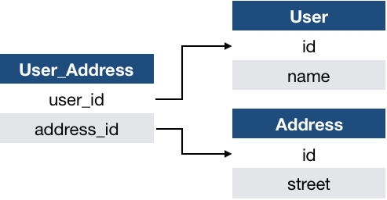
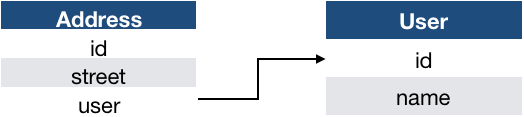
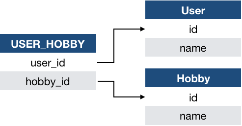
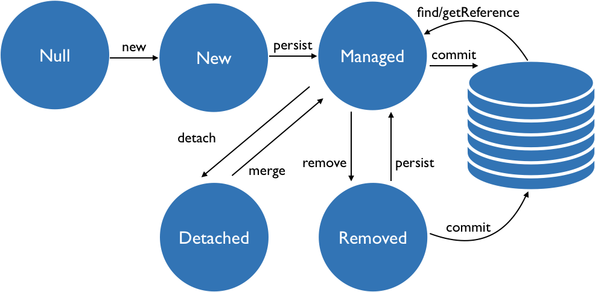
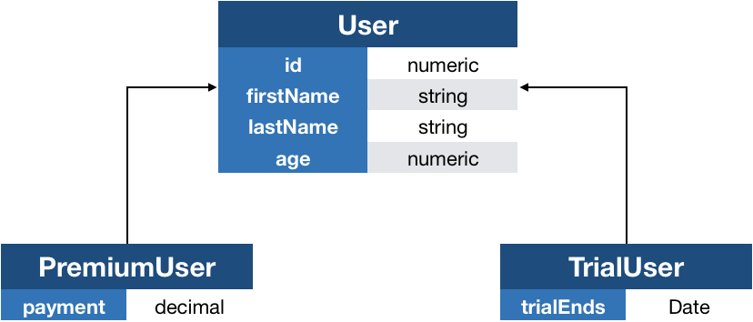

== Persistence

=== Data store access

Um einer Anwendung den Zugriff auf Datenbanken zu ermöglichen, gibt es von den Herstellern Bibliotheken.
Ein kurzes Beispiel zeigt den Zugriff auf eine MySQL Datenbank mit Hilfe des Treibers und Java Boardmitteln.

.SimpleDataAccess
[source,java]
----
Driver driver = ClassForName(MySQL....)
----

Es ist leicht erkennbar, dass an dieser Stelle ein großer Unterschied im Abstraktionslevel der Anwendung entsteht.
Auf der einen Seite existiert eine ausformulierte Klasse, die einen `User` darstellt, aber auf der anderen Seite kommen nur "rohe" Daten aus der Datenbank.

Natürlich kann man nun Code schreiben, der das Mapping auf diese Klasse vornimmt.
Sobald die Anwendung aber komplexer wird und Änderungen hinzukommen, ist man mehr mit der Wartung des Infrastrukturcodes beschäftigt als mit der Entwicklung von Businesslogik.

Für die Aufgabe dieses _Object Relational Mappings_ (ORM) gibt es in der Welt der *relationalen Datenbanken* die _Java Persistence API_ (JPA).

=== Java Persistence API

Die JPA beschreibt, wie der Zugriff auf Datenbanken und die Konvertierung von und zu Objekten geschieht.
EclipseLink ist die Referenzimplentierung und ist neben der Implementierung Hibernate eine der meistgenutzten.
Hibernate steht z.B. als Defaultimplementierung im Applicationserver WildFly zur Verfügung.
JPA bzw. deren Implementierungen können auch abseits von JavaEE eingesetzt werden, z.B. in einfachen Javaanwendungen oder auch in Spring Framework basierenden Projekten.

In einer (komplexen) Businessanwendung ist meist der Datenbankzugriff kaum von Businessvalue, daher wird versucht diesen mittels JPA zu abstrahieren.
Die Entwickler müssen im besten Fall wenig Zeilen SQL schreiben, um mit der Datenbank kommunizieren zu können.
Hibernate übernimmt in diesem Fall die Generierung von SQL Skripten, um einfache Abfragen out-of-the-box zu ermöglichen.

==== Domainklassen / Entitäten

Lässt man die (u.U. sehr simple) Konfiguration von Hibernate außen vor, ist die erste Aufgabe das Annotieren von Klassen, deren Instanzen später in die Datenbank gespeichert werden soll.

.Einfaches Mapping einer Domainklasse (I)
[source,java]
----
@Entity
public class User {

	@Id
	private Long id;
	private String name;

    // Getter / Setter etc.
}
----

==== Id Feld

In dieser Form muss die künstliche Id jedoch selber gesetzt werden, bevor eine Instanz dieser Klasse gespeichert werden kann.
Dies führt bei schon vorhandenen Daten in der Datenbank zu einem nicht zu unterschätzenden Aufwand, da gerade beim Id-Feld die Einzigartigkeit eingehaltet werden muss/sollte.
JPA kann dieses vereinfachen, indem zu der `@Id` Annotation auch noch die Annotation `@GeneratedValue` verwendet wird.
Dazu sollte noch angegeben werden, welche Strategy gewünscht ist.

.GenerationTypes für `@GeneratedValue` strategy
|===
|Strategy|Beschreibung
|AUTO|Die Implementierung entscheidet, was sie als beste Lösung für das Erzeugen von Ids sieht. Dabei wird auch die gewählte Datenbank mit berücksichtigt.
|IDENTITY|Das Id Feld in der Datenbank für mit einem Flag versehen, das dafür sorgt, dass automatisch der Wert gesetzt wird. Dabei wird der Wert der Spalte beim Anlegen von neuen Zeilen inkrementiert.
|SEQUENCE|Nutzt die Sequence Funktionalität der Datenbank.
|TABLE|Erzeugt eine Tabelle, die alleine dafür zuständig ist, die Ids zu verwalten.
|===

Die Nutzbarkeit von bestimmten Strategien kann durch den eingesetzten Datenbankvendor eingeschränkt werden, falls dieser es nicht unterstützt.
In den nachfolgenden Beispielen wird zur Vereinheitlichung `AUTO` verwendet.

Die Entität würde dann wir folgt aussehen.

.Einfaches Mapping einer Domainklasse (II)
[source,java]
----
@Entity
public class User {

@Id
@GeneratedValue(strategy = GenerationType.AUTO)
private Long id;
private String name;

  // Getter / Setter etc.
}
----

==== Datenbanktabelle

Wenn nun Hibernate verwendet wird (konkrete Code-Beispiele folgen weiter unten), werden Objekte dieser Klasser in die Tabelle _User_ mit den Spalten _id_ und _name_ gespeichert.
Dies ist mit einem Blick auf die definierte Klasse auch zu erkennen, denn dieses sind die Namen der Klassen und ihrer Attribute.

Durch die zusätzliche Annotation `@Table` an der Klassendefinition können die tabellenspezifischen Eigenschaften konfiguriert werden.

.Verwendung der `@Table` Annotation
[source,java]
----
@Table(name="USER", uniqueConstraints = @UniqueConstraint(columnNames = {"name"}))
@Entity
public class User {/*...*/}
----
Gerade wenn Daten in der Datenbank vorhanden sind und/oder die Datenbank nicht durch das Team verwaltet wird, kann es sein, dass der Entitätsname nicht der Datenbanktabelle enspricht.
Durch das Parameter `name` kann der entsprechende Name gesetzt werden.
Auch bestimmte Regeln (_constraints_) bzgl. Einzigartigkeit (_uniqueness_) lassen sich mit Hilfe der `@Table` Annotation realisieren.
In diesem Beispiel wird definiert, dass der Name eines Benutzers nur einmal in der Tabelle vorkommen kann.
Die Annotation kann darüber hinaus auch Indizies (`indexes`) definieren, die für bestimmte Spalten vergeben werden können.
Indizies werden verwendet, um Daten anhand von bestimmten Spalten(-kombinationen) schneller auffinden zu können.

NOTE: Ein Index kommt nicht umsonst, sondern bedarf Pflege (Updates beim Speichern und Löschen von Datensätzen) und die benötigt Zeit während der jeweiligen Operation.

==== Attribute

Auch die Persistenz von Attributen einer Klasse lässt sich detailiiert konfigurieren.
Die Annotation, die hierfür verwendet wird, nennt sich `@Column` und bietet (auszugsweise) folgende Parameter an.

|===
|Parameter|Typ|Default|Beschreibung
|name|String|Name des Attributs in der Klasse|Spaltenname in der Tabelle
|unique|boolean|false|Unique constraint
|nullable|boolean|true|`NULL` Wert erlaubt
|length|int|255|Länge, wenn Attribut String(ähnlich) ist
|precision|int|0|Gesamte Ziffern zur Darstellung von Dezimalzahlen
|scale|int|0|Anteil der Nachkommastellen bei Dezimalzahlen
|===

===== Enumerations

Für Aufzählungstypen gibt es eine spezielle Annotation, um ihre Persistence zu beschreiben.
Mittels `@Enumerated` kann bestimmt werden, wie der Typ gespeichert werden soll.

* `ORDINAL` Der Default speichert die Ordinalzahl des Enumwertes.
* `STRING` Speichert den Namen des Enumwertes.

Angenommen es wird das Feld `Experience experience` in einer zu persistierenden Klasse verwendet.
Im folgenden Codebeispiel werden die unterschiedlichen Spaltenwerte, die durch `@Enumerated` erzeugt werden dargestellt.

. Beispiel Enum persistence
[source,java]
----
enum Experience {
    BEGINNER, // ORDINAL: 0 / STRING: "BEGINNER"
    ADVANCED, // ORDINAL: 1 / STRING: "ADVANCED"
    EXPERT // ORDINAL: 2 / STRING: "EXPERT"
}
----

Wie auch bei Änderungen an den Typen einer Klasse, muss bei einer Enum besonders darauf geachtet werden, dass diese under Umständen dazu führen kann, dass falsche Werte geladen werden.
Dies betrifft bei `ORDINAL` schon das einfache Umsortieren innerhalb der Enum und bei `STRING` das Umbenennen von Enumwerten.

===== Datumswerte

Um einen Datumswert (`Date` oder `Calendar`) zu persistieren, bietet JPA die Annotation `@Temporal` an.
Dabei kann der Wert `DATE`, `TIME` oder `TIMESTAMP` sein.
Wie an den Werten leicht zu erkennen ist, wird hiermit der Detailgrad bestimmt, mit dem der Datumstyp zu speichern ist.

* `DATE` datumsgenau
* `TIME` nur Uhrzeit
* `TIMESTAMP` Datum und Uhrzeit

===== Transiente Werte

Da JPA sowohl auf Feldern als auch auf _Getter_ (`is..()`, `get...()`) schaut, um mögliche Werte für das Speichern zu finden, kann es sein, dass eine Hilfsfunktion in einer Entitätsklasse versehentlich als ein zu persistierendes Feld interpretiert wird.
Um dieses Problem zu umgehen gibt es die Möglichkeit solche Methoden mit `@Transient` auszuschließen.

Das nachfolgende Codebeispiel zeigt die Verwendung von `@Transient` anhand eines einfachen Beispiels.

.Transiente Methoden
[source,java]
----
public class User {
    private boolean activated; // Benutzeraccount aktiviert
    private boolean locked; // Benutzeraccount gesperrt

    @Transient
    public boolean isAllowedToLogIn() {
        return activated && !locked;
    }
}
----

Für die Businesslogik gibt es in dem Beispiel einen berechneten Wert, der nicht persistiert werden soll.
Damit JPA nicht versucht, diesen Wert in die Datenbank zu schreiben, muss die Methode mit `@Transient` annotiert werden.

==== Beziehungen

Um Beziehungen zwischen Entitäten abzubilden, bietet JPA weitere Annotations an.

|===
|Annotation|Beschreibung
|@OneToOne|1:1 Beziehung zwischen zwei Entitäten
|@OneToMany|1:n Beziehung
|@ManyToOne|n:1 Beziehung
|@ManyToMany|n:m Beziehung
|@ElementCollection|Sammlung von Basistypen oder sog. _embedded types_. Kann mittels `@CollectionTable` konfiguriert werden.
|===

===== @OneToOne

.Beipiel für eine `@OneToOne` Verknüpfung
[source,java]
----
@Entity
public class User {

   // weitere Felder

    @OneToOne(cascade = CascadeType.ALL, orphanRemoval = true)
    Address address;

}
----

In diesem Beispiel wird eine Adresse mit dem Benutzer verknüpft.
Alle Operationen, die auf dem `User` Objekt ausgeführt werden, kaskadieren in das `Address` Objekt, d.h. eine Adressänderung wird gespeichert, wenn das `User` Objekt gespeichert oder aktualisiert wird.
Weitere ausgewählte Parameter sind in der folgenden Tabelle beschrieben.

.Ausgewählte Parameter für `@OneToOne`
|===
|Parameter|Default|Beschreibung
|`cascade`|[]|Welche Art von Änderungen in die verknüpfte Entität kaskadieren sollen.
|`fetch`|eager|Eager oder lazy fetching.
|`orphanRemoval`|false|Löschen der führenden Entität führt zum Löschen der verknüpften.
|===

===== @OneToMany

.Beipiel für eine `@OneToMany` Verknüpfung
[source,java]
----
@Entity
public class User {

   // weitere Felder

    @OneToMany(cascade = CascadeType.ALL, orphanRemoval = true)
    Set<Address> deliveryAddresses;

}
----

Ähnlich wie das Beispiel aus dem vorherigen Abschnitt, werden nun mehrere Adressen zu einem Benutzer gespeichert.

JPA wird an dieser Stelle eine sogenannte Mappingtabelle einführen, um die Datensätze zu verknüpfen.
Dieses Verhalten ist für den Anwender auf den ersten Blick nicht intuitiv und kann bei Bedarf angepasst werden (siehe _@ManyToOne_).

.Mappingtabelle

.Ausgewählte Parameter für `@OneToMany`
|===
|Parameter|Default|Beschreibung
|`cascade`|[]|Welche Art von Änderungen in die verknüpfte Entität kaskadieren sollen.
|`mappedBy`|-|Name der Property für die Beziehung.
|`fetch`|lazy|Eager oder lazy fetching.
|`orphanRemoval`|false|Löschen der führenden Entität führt zum Löschen der verknüpften.
|===

===== @ManyToOne

Es ist möglich, Beziehungen bidirektional zu gestalten.
Dafür wird die Annotation `@ManyToOne` in der verknüpften Entität verwendet.

.Beispiel für bidirektionale Beziehung
[source,java]
----
@Entity
public class User {

   // weitere Felder

    @OneToMany(mappedBy = "user", /*weitere parameter*/)
    Set<Address> deliveryAddresses;

}

@Entity
public class Address {

   // weitere Felder

    @ManyToOne
    @JoinColumn(name = "user")
    User user;

}
----

Durch das zusätzliche Definieren einer `@JoinColumn` wird JPA angewiesen, das Datenbankschema wie folgt zu gestalten.

.Bidirektionales Mapping

Dies bedeutet, dass beim Laden der verknüpften Adressen immer alle Adressen mit der gleichen User-Id geladen werden.

===== @ManyToMany

Die `@ManyToMany` Beziehung bietet sich an, wenn mehrere (Haupt-)Entitäten die gleichen verknüpften Entitäten verwenden.

Ein kleines Codebeispiel dazu:

.`@ManyToMany` Verknüpfung
[source,java]
----
@Entity
public class User {

    @ManyToMany
    @JoinTable(
        name="USER_HOBBY",
        joinColumns=@JoinColumn(name="USER_ID", referencedColumnName="ID"),
        inverseJoinColumns=@JoinColumn(name="HOBBY_ID", referencedColumnName="ID"))
    private List<Hobby> hobbies;

}
----

Hier wird als Beispiel angenommen, dass mehrere Benutzer das gleiche Hobby bzw. die gleichen Hobbies ausüben.
Als zusätzliche Annotation wird an dieser Stelle `@JoinTable` verwendet, um die Mappingtabelle zu definieren.
Das daraus resultierende Schema sieht ähnlich aus, wie das unkonfigurierte aus einer `@OneToMany` Beziehung resultierende.

.`@ManyToMany` Schema

==== Datenzugriff mit JPA

Im Zentrum von JPA steht der `EntityManager`, der für den Datenzugriff (speichern, lesen, updaten und löschen) zuständig ist.
Darüber hinaus hält dieser den _Persistenzkontext_, in dem u.a. schon geladene Entitäten vorgehalten werden, um unnötige nachfolgende Konvertierungen von Datenbankeinträgen auf Javaobjekte zu vermeiden.

Um die Operationen in JPA nachvollziehen zu können, bietet sich ein Blick auf den Lebenszyklus einer Entität an.

.Lebenzyklus einer Entität

Der erste Schritt von _Null_ auf _New_ bezieht sich ausschließlich auf die Javawelt und beschreibt der Vollständigkeit halber, die Erstellung eines neuen Javaobjekts.
Wird der `EntityManger` angewiesen, dass Objekt zu persistieren, so wird es zu einer _managed_ Entität und in den Persistenzkontext aufgenommen.
Folgt man dem oberen Pfad, muss nur noch die laufende Transakation (siehe unten) "commited" werden, um das Objekt / die Entität in der Datenbank zu speichern.
Wie auch später in den Beispielen zu sehen ist, gibt es keine explizite Operation für das Update von Entitäten.
Dieses passiert durch den Commit implizit.

Das Entfernen von vorher geladenen Objekten geschieht durch den Aufruf von `remove`.
Falls noch kein Commit erfolgt ist, kann ein _removed_ Objekt durch ein erneutes `persist` wieder in den _Managed_ Zustand gelangen.

Sollen _managed_ Entitäten aus dem Persistenzkontext entfernt bzw. wieder aufgenommen werden, so ist diesen mit den Methoden `detach` und `merge` möglich.

Ein Eintrag kann aus der Datenbank mittels `find` oder `getReference` geladen werden.
Dieser steht dann sofort im Persistenzkontext zur Verfügung.

===== Codebeispiele

In diesem Abschnitt werden (einfache) Beispiele für die Datenzugriffsoperationen gezeigt.
Dabei wird bei vielen eine Transaktion verwendet, deren Zweck im nachfolgenden Abschnitt beschrieben wird.

.Speichern
[source,java]
----
User user = new User("Max", "Mustermann", 22);

entityManager.getTransaction().begin();
entityManager.persist(user);
entityManager.getTransaction().commit();
----

Bei diesem Beispiel bezüglich des Speicherns wird zuerst ein komplett neues Objekt erstellt, um dann mit der Funktion `persist` des _EntityManagers_ gespeichert zu werden.

.Laden
[source,java]
----
User loadedUser = entityManager.find(User.class, userId);
// oder
User loadedUser = entityManager.getReference(User.class, userId);
----

Soll ein Objekt geladen werden, so kann dieses mit einer bekannten Id erfolgen.
Die `find` Methode gibt direkt das zu ladende Objekt oder `null` zurück.
Bei der `getReference` Methode wird zuerst ein Proxyobjekt erzeugt, welches beim ersten Zugriff erst die Existenz des zu ladenden Eintrags überprüft.
Dies kann dazu führen, dass erst später im Code eine Exception geworfen wird, die darauf hinweist, dass das zuvor geladene Objekt gar nicht existiert.

NOTE: Sich auf (technische) Ids zu verlassen und als "Wissen" in der Applikation zu halten ist nicht nur schlechter Stil, sondern kann zu Fehlern im längeren Betrieb der Anwendung führen.
So kann z.B. eine Datenmigration auf eine andere Datenbank vorgenommen werden, bei der sich die (technischen) Ids ändern.
Ab diesem Moment besteht für die Anwendung keine Möglichkeit mehr, auf die Einträge mit festen Ids zuzugreifen, da diese unter diesen Ids nicht mehr existieren.

.Update
[source,java]
----
User user = entityManager.find(User.class, userId);

entityManager.getTransaction().begin();
user.setFirstName("Hans");
entityManager.getTransaction().commit();
----

Das Update erfoglt, wie schon oben erwähnt, implizit beim Commit der Transaktion.
Dabei werden alle _managed_ Entitäten, die verändert wurden, gespeichert.

.Löschen
[source,java]
----
User user = entityManager.find(User.class, userId);

entityManager.getTransaction().begin();
entityManager.delete(user);
entityManager.getTransaction().commit();
----

Entitäten können innerhalb einer Transaktion auch wieder gelöscht werden.
Hierzu muss explizit die `delete` Methode des `EntityManager` aufgerufen und die Transaktion committed werden.

==== Transaktionen

Wie schon in den vorangegangen Beispielen zu sehen war, kommt bei schreibenden Operationen eine Transaktion zum Einsatz.
Diese wird benötigt, um einerseits nach JPA-Spezifikation die Intention einer Datenmanipulation zu beschreiben und andererseits als Sicherheit für einen in sich geschlossen Block an Arbeit (Unit of Work).
Die Eigenschaften einer Transaktion lassen sich mit dem Acronym _ACID_ bezeichnen.
Dieses steht für:

* **A**tomicity - Entweder werden alle Operationen innerhalb einer Transaktion ausgeführt oder keine einzige.
* **C**onsistency - Es ist sichergestellt, dass alle (Datenbank-)Constraints eingehalten wurden.
* **I**solation - Mehrere Transaktionen beeinflussen sich nicht gegenseitig.
* **D**urability - Am Ende einer Transaktion ist ihr Zustand dauerhaft in der Datenbank gespeichert.

Man kann bildlich auch davon sprechen, dass eine Transaktion eine Funktion ist, die einen Datenbankzustand _A_ nimmt und durch ihre Anwendung in einen Zustand _B_ überführt.

==== Locking

Um eine weitere Sicherheit nicht nur während einer Transaktion, sondern auch während des Lebenszyklus einer _managed_ Entität zu gewährleisten, existiert das Konzept des Locking.
Dabei werden Tabellen oder einzelne Zeilen für andere Optionen, je nach Konfiguration, gesperrt.
Diese Locking wird in zwei Kategorien aufgeteilt: Optimistic und Pessimistic Locking.

===== Optimistic Locking

Das optimistische Locking geht von einer Laufzeit aus, in der sehr selten Kollisionen auftreten werden und sperrt Einträge nur für den kurzen Zeitraum einer schreibenden Operation.
Dies wird durch die Einführung eines Feldes mit der Annotation `@Version` an der gewünschten Entität erreicht.

.Optimistic Locking mit `@Version`
[source,java]
----
@Entity
public class User {

    @Version
    private int version;

}
----

Der numerische Typ des Feldes kann dabei `int`, `Integer`, `short`, `Short`, `long`, `Long` oder aber auch `Timestamp` sein.
Kommt es nun zu einem Update oder Delete eines Datensatzes, so wird der erzeugte Query um das Versionsattribut erweitert und endet beispielsweise mit `...where id=x and version=y`.
Wurde in der Zwischenzeit eine andere Operation auf der Datenbank ausgeführt, welche zwangsläufig die Version erhöht hat, wird der Query trotz dem impliziten Wissen, dass dieser Eintrag vorhanden sein muss, kein Ergebnis bekommen.
Die Aktion endet dann in einer `OptimisticLockException` und muss manuell wiederholt werden.
Dazu muss u.U. die Entität auch erneut aus der Datenbank geladen werden, da sich ihre Version geändert hat.

===== Pessimistic Locking

Im Gegensatz zum optimistischen Locking geht das pessimistische Locking der Idee nach, dass (in Teilen der Anwendungen) häufig Kollisionen auftreten können.
Vereinfacht lässt sich sagen, dass hier nach dem _first come, first server_ Prinzip gearbeitet wird:
Der erste _lesende_ Zugriff auf einen Datensatz, sperrt diesen für weitere Zugriffe.
Nachfolgende Operationen müssen warten bis dieser Lock wieder entfernt wurde.

.Pessimistic Locking
[source,java]
----
// bspw.
User loadedUser = entityManager.find(User.class, userId, LockModeType.PESSIMISTIC_READ);
// oder
User loadedUser = entityManager.find(User.class, userId, LockModeType.PESSIMISTIC_WRITE);
----

Wie eingangs schon erwähnt wurde, werden die Datensätze beim Lesen gesperrt.
Der Modus des Sperren kann dabei wie folgt konfiguriert werden:

* `PESSIMISTIC_READ` - Verhindert `PESSIMISTIC_WRITE` Locks, lesende Zugriffe sind weiterhin möglich.
* `PESSIMISTIC_WRITE` - Verhindert sowohl `PESSIMISTIC_WRITE` als auch `PESSIMISTIC_READ`.
* `PESSIMISTIC_FORCE_INCREMENT` - Verhindert `PESSIMISTIC_WRITE` und `PESSIMISTIC_READ` und erhöht den Wert des Versionsfeld.
Dieser Modus führt somit zu einem doppelten (optimistic und pessimistic) Locking, welches sich auch auf die Performance der Operationen niederschlägt.

Läuft eine Operation, die darauf wartet, dass ein Lock freigegeben wird, in einen Timeout, wird eine `PessimisticLockException` geworfen.
Auch in diesem Fall ist es die Aufgabe des Entwicklers, darauf zu reagieren und es erneut zu versuchen, wenn gewünscht.

==== Java Persistence Query Language (JPQL)

Für die meisten Anwendungen ist das Laden, Updaten oder Löschen einer Entität mit ihrer Id nicht ausreichend.
In der Praxis kommt es zu komplexeren Queries, die nicht mit einem einfachen `find` abgebildet werden können.
Für diese Fälle stellt JPA die JPQL zur Verfügung.

Die Idee ist es, eine SQL-ähnliche Sprache zu verwenden, um Anfragen an die Datenbank zu formulieren.
Hierbei kommen hauptsächlich zwei Methoden zum Einsatz:

* `Query createQuery(String queryString)` - Erzeugt einen _untypisierten_ Query, um z.B. mehrere mögliche Ergebnistypen zu verarbeiten.
* `TypedQuery<T> createQuery(String queryString, Class<T> class)` - Erzeugt einen _typisierten_ Query, damit nach der Abfrage sofort mit den richtigen Objekten/Objekttypen gearbeitet werden kann.

===== Select

.Select mit JPQL
[source,java]
----
Query genericQuery = entityManager.createQuery("SELECT user FROM User user WHERE user.firstName='Max'");
List users = genericQuery.getResultList();
----
Die erste Zeile generiert den untypisierten Query, der in dieser Stelle noch nicht ausgeführt wird.
Erst beim Aufruf von `getResultList()` wird die Anfrage an die Datenbank gestellt.

.Select mit typisiertem Query
[source,java]
----
TypedQuery<User> userByNameQuery = entityManager.createQuery("SELECT user FROM User user WHERE user.firstName='Max'", User.class);
List<User> users = userByNameQuery.getResultList();
----
Wie leicht zu sehen ist, kann an dieser Stelle direkt mit der Ergebnisliste vom Typen User gearbeitet werden.

===== Platzhalter

In beiden Beispielen wurde schon eine Einschränkung der Ergebnismenge nach Namen vorgenommen.
Das dort ein fester Wert steht ist eigentlich seltener der Fall, und man möchte hier Platzhalter verwenden.
Auch dieses ist mit JPQL möglich.

An der Stelle, an der vorher der Wert stand, wird ein beliebiger Variablenname mit einem führenden Doppelpunkt hinzugefügt.

.Select mit Platzhalter
[source,java]
----
TypedQuery<User> userByNameQuery = entityManager.createQuery("SELECT user FROM User user WHERE user.firstName=:name", User.class);
userByNameQuery.setParameter("name", "Max");
----
Das Setzten des konkreten Wertes erfolgt nun später über die Methode `setParameter` am Queryobjekt.

===== Update / Delete

Auch Updates und Deletes sind mit JPQL möglich.

.Update in JPQL
[source,java]
----
Query updateQuery = entityManager.createQuery("UPDATE User user SET user.firstName=:newName WHERE user.firstName=:name");

updateQuery.setParameter("newName", "Hans");
updateQuery.setParameter("name", "Max");
updateQuery.executeUpdate();
----

.Delete in JPQL
[source,java]
----
Query deleteQuery = entityManager.createQuery("DELETE from User user WHERE user.firstName=:name");

deleteQuery.setParameter("name", "Max");
deleteQuery.executeUpdate();
----

Wie in diesen beiden Beispielen zu erkennen ist, können auch hier Parameter sowohl für die Eingrenzung der Ergebnisse, als auch das Zuweisen von Werten verwendet werden.
Darüber hinaus müssen datenmanipulierende Operationen immer mit einem `executeUpdate()` ausgeführt werden.
Diese Methode gibt die Anzahl der durch die Operation betroffenen Zeilen zurück.

===== Named queries

Mit der Zeit wächst eine Anwendung und die Statements können sich durch den Source Code verteilen, wenn man nicht streng darauf achtet.
Eine Möglichkeit, dieses zu vermeiden, ist die Nutzung von _Named Queries_.
Das bedeutet, es werden Queries vordefiniert, welche im Idealfall an der zugehörigen Entitätsklasse definiert und gesammelt werden.

.Definition von NamedQueries
[source,java]
----
@NamedQueries({
    @NamedQuery(name = "User.findByName",
        query = "SELECT user from User user where user.firstName='Max'")
}
)
@Entity
public class User {
    /*...*/
}
----

.Nutzung von NamedQueries
[source,java]
----
TypedQuery<User> genericQuery = entityManager.createNamedQuery("User.findByName", User.class);
----

Diese Queries können dann über ihren vordefinierten Namen aufgerufen werden.
Auch hier ist es möglich, PLatzhalter zu vergeben.

==== Vererbung in Entitäten

In objektorientierten Programmiersprachen ist es üblich Vererbung einzusetzen.
Damit sich dieses auch in der Persistenzschicht der Anwendung abbilden lässt, gibt es verschiedene Möglichkeiten.

.Einfache Vererbung

Das Userbeispiel wurde an dieser Stelle um die Klassen `TrialUser` und `PremiumUser` erweitert, die jeweils eine einzigartige Eigenschaft besitzen.

Es stehen drei unterschiedliche Arten des Mappings zur Verfügung, um diese (einfache) Klassenhierarchie in der Datenbank zu persistieren (Codebeispiel folgt nach der Auflistung):

* `SINGLE_TABLE`: Es werden die Felder aller Klassen in eine Tabelle geschrieben.
Dabei wird durch eine sog. `DiscriminatorColumn` und dessen Wert `DiscriminatorValue` festgelegt, um welchen konkreten Typen es sich bei diesem Eintrag handelt.
`SINGLE_TABLE` bietet sich an, wenn die Anzahl der unterschiedlichen Felder gering ist.
* `JOINED`: Wie der Name schon erahnen lässt, wird in diesem Modus eine weitere Tabelle für jede konkrete Klasse angelegt, die nur die Felder dieser Klasse speichert.
Der Vorteil ist, dass pro Eintrag in der Basistabelle und "gejointer" Tabelle keine Felder der nicht genutzten Klasse mit default oder `null` Werten aufgefüllt werden müssen, um dem Schema zu entsprechen.
Im Gegensatz zu `SINGLE_TABLE` kann so auch vermieden werden, dass die Tabelle zu "breit" wird und nicht mehr alle Spalten halten kann.
* `TABLE_PER_CLASS`: Für jede konkrete Klasse wird eine Tabelle angelegt, die _alle_ Felder sowohl des Basistypen als auch der konkreten Klasse enthält.
Ist die Anzahl der Felder der Basisklasse gering im Vergleich zu den konkreten Klassen, so bietet sich dieses Speichermodell an.

Am Beispiel einer Hierarchie, die im `SINGLE_TABLE` Modus gespeichert wird, soll noch einmal gezeigt werden, wie die Annotation `@Inheritance` an der Basisklasse genutzt wird.

.Vererbung persistieren (`SINGLE_TABLE`)
[source,java]
----
@Entity
@Inheritance(strategy = InheritanceType.SINGLE_TABLE)
@DiscriminatorColumn(name = "user_type")
public abstract class User {
    /* basisfelder etc. */
}

@Entity
@DiscriminatorValue("p_user")
public class PremiumUser extends User {
    double payment;
}

@Entity
@DiscriminatorValue("t_user")
public class TrialUser extends User {

    @Temporal(TemporalType.DATE)
    Date trialEnds;
}

----

=== Spring Data

Auch wenn JPA in Bezug auf relationale Datenbanken eine Abtraktion des direkten Zugriffs per SQL bietet, so kann dieser noch weiter abstrahiert werden.
Im Spring Ökosystem stehen für diesen Zweck die _Spring Data_ Projekte zur Verfügung.
In diesem Bereich gibt es Unterstützung für viele bekannte Data Stores und Technologien, u.a.

* JPA
* JDBC
* Neo4j
* MongoDB
* Redis
* Cassandra

um nur einige zu nennen.

Dabei ist das Prinzip in allen Projekten gleich:
Es werden für den Datenzugriff sog. _Repositories_ erstellt, die entweder ein vom Data Store bereitgestelltes oder ein generisches Interface erweitern.
Bspw. für Neo4j wäre dieses `Neo4jRepository` oder das generische, dadurch im Funktionsumfang etwas eingeschränktere und in allen Projekten verfügbare `CrudRepository`.

Das Repository im Anwendungscode ist wiederum auch nur ein Interface und definiert den Zugriff auf eine Domainklasse.

.Einfaches Repository
[source,java]
----
public interface UserRepository extends CrudRepository<User, Long> {}
----

Dies wäre schon ein vollständiges Repository für die Entität `User` mit einem Id Attribut vom Typen `Long`, wie sie schon in den vorhergenden Beispielen vorgestellt wurde.
Durch dieses Interface ist es nun schon möglich, einfache Operationen mit den Entitäten auszuführen.

.Einzeloperationen
[source,java]
----
// Annahme, dass die Typen wie folgt aussehen
// User user
// Long id

userRepository.findById(id);
userRepository.existsById(id);

userRepository.save(user);

userRepository.delete(user);
userRepository.deleteById(id);
----

.Massenoperationen
[source,java]
----
// Annahme, dass die Typen wie folgt aussehen
// Collection<User> users
// Collection<Long> ids

userRepository.count();

userRepository.findAll();
userRepository.findAllById(ids);

userRepository.saveAll(users);

userRepository.deleteAll();
userRepository.deleteAll(users);
----

==== Query methods

In den meisten Anwendungen ist es nicht möglich mit diesem geringen Funktionsumfang auszukommen.
Deshalb bieten die Repositories _query methods_ an, um mehr Anwendungsfälle abdecken zu können.
Hierbei handelt sich erst einmal nur um weitere Methodendefinitionen im Repositoryinterface.

.query methods
[source,java]
----
public interface UserRepository extends CrudRepository<User, Long> {

    List<User> findByFirstName(String firstName);

    List<User> findByFirstNameIgnoreCase(String firstName);

    List<User> findByFirstNameAndLastName(String firstName, String lastName);

    List<User> findDistinctByFirstNameAndLastNameAllIgnoreCase(String firstName, String lastName);

    List<User> findByFirstNameStartingWith(String firstNameStart);

}
----

In dem Beispiel ist schnell ein Schema zu erkennen, welches Spring Data verfolgt, um zu erkennen, was die Intention des Entwicklers bei der Definition einer query method ist.
Dabei wir zuerst auf die einleitenden Schlüsselworte `find...By`, `read...By`, `query...By`, `count...By` und `get...By` geachtet.
Diese geben an, dass eine Methode ein Query einleiten soll.
Nach dem `...By` wird eine Property der Entitätsklasse, hier der `User` Klasse, erwartet, nach der die Daten z.B. gefiltert werden sollen.

Den Properties können optional noch Schlüsselworte für die Generierung des Queries folgen (`IgnoreCase` oder `StartingWith` siehe Beispiel).
Diese Schlüsselworte sind jedoch stark vom Data Store und dessen Treiberunterstützung abhängig, d.h. es ist immer die jeweilige Spring Data Projekt Dokumentation zu studieren, welche Schlüsselworte unterstützt werden.
Die Properties (und zugehörige Schlüsselworte) können mit `And` und `Or` verbunden werden, um auch komplexerer Abfrage zu ermöglichen.

==== Custom queries

Reicht die Freiheit durch query methods nicht aus, kann zu _custom queries_ gegriffen werden.
Diese werden durch die Annotation `@Query` an einer Methode gekennzeichnet.

.custom queries
[source,java]
----
public interface UserRepository extends CrudRepository<User, Long> {

    @Query("SELECT u from User u where u.firstName = 'Max'")
    List<User> loadWithCustomQuery();

    @Query("SELECT u from User u where firstName = ?1")
    List<User> loadWithCustomQuery(String firstName);

    @Query("SELECT u from User u where firstName = :name")
    List<User> loadWithCustomQuery(@Param("name") String firstName);
}
----

Der Inhalt des Queries ist wiederum vom Data Store und/oder dessen Treiber abhängig.
In dem Beispiel sieht man JPQL, welches in Spring Data JPA verwendet wird.
Darüberhinaus ist die Parametrisierbarkeit zu erkennen:
Dem Benutzer ist dabei überlassen, ob er position oder named based arbeiten möchte.
Die meisten Spring Data Projekte unterstützen beide Arten der Parameterdefinition.

Bis jetzt wurden nur lesende Operationen betrachtet.
Es ist mit custom queries auch möglich datenmanipulierende Queries zu erstellen.
Dazu muss dem `@Query` noch die Annotation `@Modifying` hinzugefügt werden.

.modifying query
[source,java]
----
@Modifying
@Query("update User u set u.firstName = :newName where u.firstName = :oldName")
    int switchNames(@Param("newName") String newName, @Param("oldName") String oldName);
}
----
Auch die Nutzung von Parametern ist hier möglich.
Wie es auch bei JPA der Fall ist, gibt Spring Data JPA in diesem Fall die Anzahl der modifizierten Einträge zurück.

==== Auditing

Einige Spring Data Projekte unterstützen auch _Auditing_.
Das bedeutet, dass festgestellt werden kann, welcher Person wann eine Entität angelegt oder zuletzt editiert hat.

NOTE: Auditing bedeutet in diesem Fall nicht, dass die gesamte Änderungshistorie einer Entität gespeichert wird.

Konzentriert auf die für das Auditing relavanten Stellen soll folgendes Beispiel helfen:

.Auditing in einer Entität
[source,java]
----
@Entity
public class User {

	@CreatedBy
	private Author createAuthor;

	@LastModifiedBy
	private Author lastEditAuthor;

	@CreatedDate
	private Date createDate;

	@LastModifiedDate
	private Date lastEditDate;

}
----

Hier ist gut zu erkennen, dass zum Erstell- und Änderungszeitpunkt Metadaten der Bearbeitung gespeichert werden.
Während die Zeitangaben out-of-the-box geschrieben werden können, muss im Gegensatz dazu der editierende Benutzer, in diesem Beispiel `Author` aus der Anwendung heraus bereitgestellt werden.
Hierfür steht das Interface `AuditorAware` bereit, welches mit dem richtigen Typen (`Author`) versehen und als Bean registriert einen editierenden Benutzer für das Speichern bereitstellen kann.

.einfache Implementierung des `AuditorAware` Interfaces
[source,java]
----
public class MyAuditorAware implements AuditorAware<Author> {
    @Override
    public Optional<Author> getCurrentAuditor() {
        Author author; // = hole Author Information
        return Optional.of(author);
    }
}
----

An der auskommentierten Stelle ist es dann z.B. möglich auf Funktionen eines Sicherheitsframeworks zuzugreifen, um den aktuell angemeldeten Benutzer zu bestimmen.

NOTE: Es ist je nach Spring Data Projekt unterschiedlich, wie Auditing aktiviert wird.

==== Spring Data JPA

Da in vielen Projekten relationale Datenbanken zum Einsatz kommen, findet Spring Data JPA an dieser Stelle noch einmal besonders Erwähnung.
Viele oben aufgeführte Beispiele haben schon JPQL als Querywert im Einsatz, welches auch der Default bei Spring Data JPA ist.

Darüberhinaus ist es in Spring Data JPA möglich die Queryannotation mit einem weiteren Attribut zu versehen: `native`.
Wenn diese Flag auf `true` gesetzt wird, wird der Query nicht mehr als JPQL sondern als reines SQL interpretiert.

.native Query
[source,java]
----
@Query(value = "SELECT * from User where firstName = 'Max'", nativeQuery = true)
List<User> loadWithCustomQuery();
----

Als weiteres JPA spezifisches Feature werden auch alle bekannten Lockmechanismen angeboten, die schon aus JPA bekannt sind.

.Locking in Spring Data JPA
[source,java]
----
@Lock(LockModeType.NONE)
@Lock(LockModeType.PESSIMISTIC_READ)
@Lock(LockModeType.PESSIMISTIC_WRITE)
@Lock(LockModeType.PESSIMISTIC_FORCE_INCREMENT)
@Lock(LockModeType.OPTIMISTIC)
@Lock(LockModeType.OPTIMISTIC_FORCE_INCREMENT)
----

Eine dieser Annotationen kann an eine _query method_ geschrieben werden, um das JPA-eigene Locking zu aktivieren.
