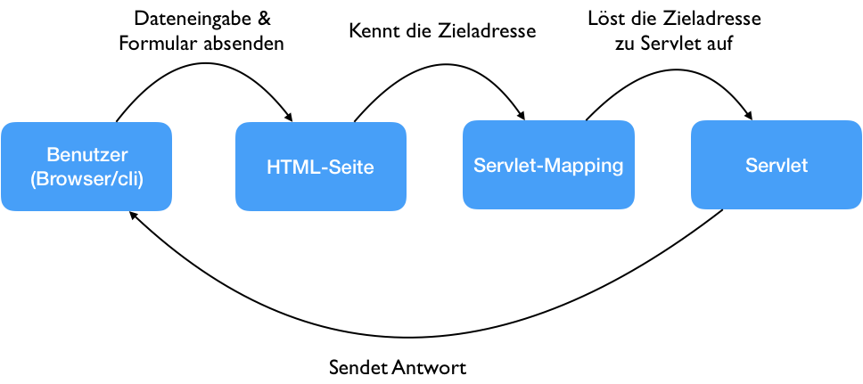
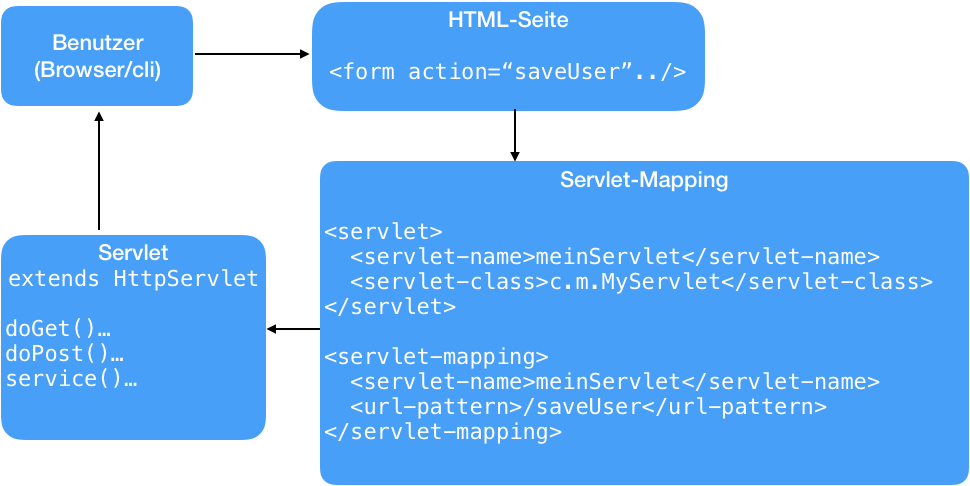
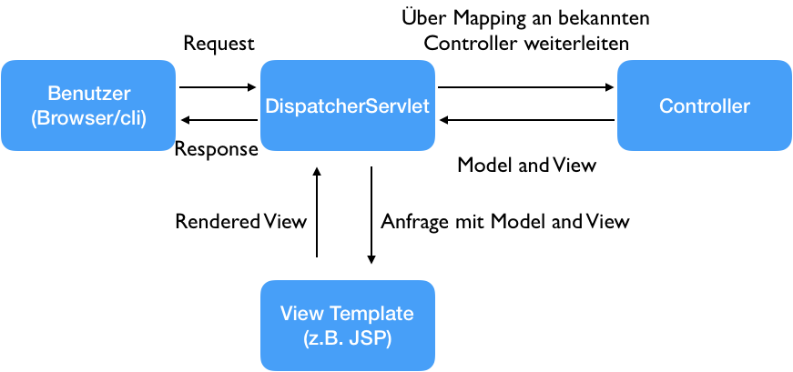

== Webanwendungen

NOTE: Unter Webanwendungen wird in diesem Skript ein HTML-Seiten auslieferndes System verstanden.

=== Server

Um eine Webanwendungen zu betreiben, bedarf es nicht nur der Anwendung selber, sondern auch einen Server, auf dem diese später ausgeführt werden soll.
In der Javawelt unterscheidet man dabei zwischen Applicationsservern und Servlet Containern.

Unter Servlet Containern werden leichtgewichtige Server verstanden, in die eine Java Servlet API (dazu später mehr) verwendende Anwendung geladen werden kann.
Alle weiteren Bibliotheken, die von der Anwendung verwendet werden, müssen für ein erfolgreiches Deployment mitgeliefert werden.

Applicationserver wiederum stellen zusätzlich zu der Grundfunktionalität, die auch Server Container bieten, die gesamte Java EE API inklusive Implementierungen bereit.
Dabei ist zu beachten, dass diese Implementierungen von Anbieter zu Anbieter von Applicationsservern wechseln und evtl. unterschiedliches Verhalten an den Tag legen kann.

=== Servlet API

Alle im Nachfolgenden vorgestellten Technologien basieren auf der (Java) Servlet API.
Um den Verlauf einer Anfrage über einen Browser und die Antwort an diesen zurück zu verstehen, wird als erstes die Verwendung der reinen Servlet API vorgestellt.

==== Servlet API mit HttpServlet

.Vereinfachte Kommunikation

Betrachtet man die Kommunikation zwischen Client (Browser/Benutzer) und der Anwendung auf dem Server etwas abstrakt, kann man gut die dedizierten Aufgaben erkennen.
Wenn der Benutzer Daten in ein HTML-Formular abgibt (siehe Bild) oder einfach nur eine bestimmte Adresse aufruft, kümmert sich der Browser darum, dass eine Anfrage gegen den Server ausgelöst wird.
Dieser schaut im _Servlet-Mapping_ der Anwendung nach, ob es ein Servlet gibt, das für die angeforderte Zieladresse registriert ist.
Ist ein solches gefunden, wird die Arbeit an das Servlet übergeben und die Antwort, die es generiert, an den Benutzer/Browser zurückgesendet.

Im Detail wird nun ein Blick auf das Servlet-Mapping und die Funktionsweise eines einfachen `HttpServlet` geworfen.

.Vereinfachte Kommunikation mit Funktionsweise

Im Bild wird das Beispiel eines abgesendeten Formulars beibehalten, welches auf der HTML-Seite mit Zieladresse definiert ist.
Wird die Anfrage nun an den Server geschickt, wird in einer vordefinierten Datei (`web.xml`) nach Einträgen für die Adresse gesucht.
Diese Einträge beziehen sich immer auf den Namen eines Servlets, welches selber auch in der Datei definiert wurde.
Die Definition eines Servlets erfolgt immer mit dem vollen Klassennamen (inkl. Packagepfad) und dem Vergeben eines frei wählbaren Namen.

.Servlet Definition in `web.xml`
[source,xml]
----
<servlet>
  <servlet-name>meinServlet</servlet-name>
  <servlet-class>c.m.MyServlet</servlet-class>
</servlet>
----
.Servlet Mapping in `web.xml`
[source,xml]
----
<servlet-mapping>
  <servlet-name>meinServlet</servlet-name>
  <url-pattern>/saveUser</url-pattern>
</servlet-mapping>
----

Mit der Nutzung der reinen Servlet API kann man eine einfache Webanwendung erstellen.
Diese bietet jedoch mangels Wissen von HTML (Templates) nur die Möglichkeit, z.B. komplette Webseiten als String zurückzuliefern.
Dieser Mangel wurde durch die JSP Definition behoben.

==== Java Server Pages

Bei Java Server Pages(JSP) handelt es sich um eine View Technologie, die auf die Servlet API aufsetzt.
Es werden Templatedateien erstellt, die teilweise in etwa so aussehen wie HTML-Seiten.
Ausgaben, Bedingungen, Schleifen und weitere Logik werden in Form von Taglibs vorgenommen.

.JSP Beispiel
[source,html]
----
<%@ page contentType="text/html;charset=UTF-8" language="java" %>
<%@ taglib prefix="c" uri="http://java.sun.com/jsp/jstl/core" %>

<html>
<head>
    <title></title>
    <link href="${pageContext.request.contextPath}/css/style.css" rel="stylesheet" type="text/css"/>
</head>
<body>

    <a href="${pageContext.request.contextPath}/heroes/create">Create hero</a>

<ul>
    <c:forEach items="${heroes}" var="hero">
        <li><a href="<c:url value="/heroes/"/>${hero.id}">${hero.name}</a></li>
    </c:forEach>
</ul>
</body>
</html>
----

Diese Templates werden, sobald sie erstmalig verwendet werden, im Servlet Container (und somit auch im Application Server) kompiliert.
Das Ergebnis ist eine Klasse, die von `HttpServlet` erbt.

=== Spring Web MVC

Mit Spring Web MVC, oder kurz Spring MVC, steht eine weitere Art der Verwendung der Servlet API für die Entwicklung von Webanwendungen zur Verfügung.
Im Gegensatz zu den im vorherigen Abschnitt beschriebenen JSP Servlets, die automatisch generiert werden, existiert in einer Spring MVC Anwendung ein zentrales Servlet: `DispatcherServer`.
Seine Aufgabe ist es, die Anfragen an die Anwendung als erstes entgegenzunehmen und dann an weitere Teile der Anwendung weiterzuleiten.

.MVC Arbeitsweise

Die eigentliche Arbeit, um die Businesslogik aufzurufen, übernimmt dabei der `Controller`.
Dieser nimmt die Anfrage inkl. Benutzerdaten entgegen und erzeugt ein _Model_, welches die Daten beinhaltet.
Darüber hinaus gibt er noch an, welche View für das Anzeigen der Daten zuständig sein soll.
Mit diesen Daten wird erneut das `DispatcherServlet` angewiesen, die passende View zu finden und ihr das Model zu übergeben, um eine (in diesem Beipsiel) HTML Seite zu rendern.
Das Ergebnis wird wiederum über das `DispatcherServlet` an den Benutzer übergeben.

==== Controller

Wie schon in der schematischen Darstellung zu sehen war, spielt der Controller eine erhebliche Rolle bei der Verarbeitung.
Ein Controller ist im Spring Ökosystem auch nur eine Bean, die durch die stereotypische Annotation `@Controller` definiert wird.
Damit dieser Controller auch auf bestimmte Zieladressen registriert werden kann, muss er zusätzlich mit der Annotation `@RequestMapping` an einer Methode die Teile der Adresse definieren, für die er zuständig ist.

.Einfacher Controller
[source,java]
----
@Controller
public class MovieController {

  @RequestMapping("/movies")
  public String listMovies() {
    return "viewName";
  }
}
----

In diesem Beispiel würde der Controller auf die Adresse `http://<server>/movies` registriert werden.
Der Rückgabewert `"viewName"` beschreibt hierbei die _logische_ View, die der Controller für das Rendering vorsieht.
Dies bedeutet nicht zwangsläufig, dass es eine physikalische Datei mit diesem Namen im Projekt geben muss.

Es ist auch möglich, dem gesamten Controller einen Adressbereich zuzuweisen, um das RequestMapping an den Methoden zu verkürzen.

.Controller mit RequestMapping
[source,java]
----
@Controller
@RequestMapping("/movies")
public class MovieController {

  @RequestMapping("/")
  public String listMovies() {
    return "viewName";
  }
}
----

Der oben dargestellte Controller würde in diesem Fall genau so arbeiten, wie der davor gezeigte.

Um nur bestimmte HTTP Methoden zuzulassen, kann `@RequestMapping` um das `method` Parameter erweitert werden.

.Controller mit Methodfilter
[source,java]
----
@Controller
@RequestMapping("/movies")
public class MovieController {

  @RequestMapping(value="/", method=RequestMethod.GET)
  public String listMovies() {
    return "viewName";
  }
}
----

.Controller mit `@GetMapping`
[source,java]
----
@Controller
@RequestMapping("/movies")
public class MovieController {

  @GetMapping("/")
  public String listMovies() {
    return "viewName";
  }
}
----

Damit die Annotationen nicht zu lang werden und der Code leserlich bleibt, gibt es für alle standard HTTP Methoden auch eine entsprechende Annotation, wie das zweite Beispiel im vorhergenden Block zeigt.
Das `@RequestMapping(value="/", method=RequestMethod.GET)` wird zu einem `@GetMapping("/")`, aber die Funktionalität bleibt die gleiche.

Um Daten von Benutzern zu verarbeiten, können diese auf unterschiedliche Weisen empfangen werden.
Den Anfang macht das _Request Parameter_.
Diese beschreibt Werte, die einem URL-Aufruf mitgegeben werden (z.B. in der Form `http://server/movies/search?*query=Matrix*`).
In der Anwendung soll nun der Wert des Parameters `query` ausgelesen werden.
Hierfür wird ein Parameter der Methodensignatur hinzugefügt: `@RequestParam`.

.Controller mit `@RequestParam`
[source,java]
----
@Controller
@RequestMapping("/movies")
public class MovieController {

  @GetMapping("/")
  public String listMovies(@RequestParam("query") String query) {
    return "viewName";
  }
}
----

An dieser Stelle steht dann das Parameter für die Programmlogik zur Verfügung.
Zu beachten ist, dass eine Definition per default erst einmal das Parameter als _required_ vorsieht.
Um es optional zu machen, kann in der Annotation das Setzten des Attributs `required = false` verwendet werden.

Es lassen sich aber auch Variablen innerhalb der URL definieren.
Dafür wird eine `@PathVariable` in der Methodensignatur definiert.
Eine URL wie z.B. `http://server/movies/details/1` kann somit wie folgt unterstützt werden.

.Controller mit `@PathVariable`
[source,java]
----
@Controller
@RequestMapping("/movies")
public class MovieController {

  @GetMapping("/details/{id}")
  public String listMovies(@PathVariable("id") Long id) {
    return "viewName";
  }
}
----

==== Model

In dem vorhergenden Abschnitt wurde nur betrachtet, wie ein Request auf eine Methode gemappt werden kann.
Der Normalfall sieht vor, dass auch Daten im Form des o.g. Models zurückgegeben werden.
Hierfür gibt es mehrere Möglichkeiten, die anhand von zwei Beispielen demonstriert werden.

.Rückgabe mit ModelAndView
[source,java]
----
@RequestMapping("/")
public ModelAndView list() {
  ModelAndView modelAndView = new ModelAndView("viewName");
  List<Movie> movies = movieService.listMovies();

  modelAndView.addObject("movieList", movies);

  return modelAndView;
}
----

.Rückgabe mit Model
[source,java]
----
@RequestMapping("/")
public String list(Model model) {
  List<Movie> movies = movieService.listMovies();

  model.addAttribute("movieList", movies);

  return "viewName";
}
----

Während im ersten Beispiel explizit eine neue Instanz eines `ModelAndView` Objektes erzeugt wird, wird im unteren Beispiel ein `Model` Objekt aus dem Spring MVC Framework bereitgestellt.
Für die HTML-Ansicht einer Webanwendung sind beide Varianten zu verwenden, man sollte sich nur auf eine festlegen, damit der Programmstil gleich bleibt.
Erst wenn es zu anderen Rückgabearten als HTML-Views kommt, spielt der Unterschied eine Rolle.

==== Validierung

In Spring MVC besteht auch die möglichkeit (komplexe) Objekte vom Benutzer entgegenzunehmen und weiter zu verarbeiten.
Wie diese Objekte in die Methode kommen, wird später vorgestellt, für diesen Abschnitt reicht die Annahme, dass der Controller die Daten erhält.

Mit der `@Valid` Annotation kann sichergestellt werden, dass dieses Objekt auch für die weitere Verarbeitung korrekt ist.

.Auszug aus `ModelForm` Klasse
[source,java]
----
public class MovieForm {
  @NotEmpty
  private String title;

  @NotNull
  private Date releaseDate = new Date();
}
----

.Methode zum Speichern
[source,java]
----
@PostMapping("/save")
public String save(@Valid MovieForm form, BindingResult bindingResult) {

  if (!bindingResult.hasErrors()) {
    return "redirect:/listView";
  }
  return "movies/createMovie";
}
----

Für die Validierung wird eine Validierungsbibliothek verwendet, die den Standard JSR 303 unterstützt.
Durch diesen werden auch die Validierungsannotationen bereitgestellt, die in der Klasse `MovieForm` verwendet werden.

.Validierungsannotation aus JSR 303
|===
|@Null|@NotNull
|@AssertTrue|@AssertFalse
|@Min|@Max
|@DecimalMin|@DecimalMax
|@Negative|@NegativeOrZero
|@Positive|@PositiveOrZero
|@Size|@Digits
|@Past|@PastOrPresent
|@Future|@FutureOrPresent
|@Pattern|
|@NotEmpty
|@NotBlank
|@Email|
|===

Nachdem die übergebenen Daten validiert wurden, wird in das `BindingResult` das Ergebnis geschrieben.
Diese kann im Fall einer negativen Validierung die Fehler halten, die später auch dem Benutzer angezeigt werden können.
Es ist zu beachten, dass eine Validierung keine Exception wirft, sondern nur das Resultat im `BindingResult` speichert.

===== Custom Validations

Um eigene Validierungen zu schreiben, muss sowohl eine Annotation als auch eine implementierende Klasse erstellt werden.
Als Beispiel soll in diesem Fall eine Validierung erstellt werden, die `@NotMatrix` heißt.
Diese überprüft, ob es sich bei einem eingegebenen Titel in der `MovieForm` um das Wort 'Matrix' handelt.

Zuerst wird die zu verwendene Annoation erstellt.

.`@NotMatrix` Annotations
[source,java]
----
@Documented
@Constraint(validatedBy = NotMatrixValidator.class)
@Target({ ElementType.FIELD })
@Retention(RetentionPolicy.RUNTIME)
public @interface NotMatrix {

	String message() default "No...not matrix again";

	Class<?>[] groups() default {};

	Class<? extends Payload>[] payload() default {};
}
----

Im Teil vor der Definition stehen folgende Annotationen:

* `@Documented` - Stellt sicher, dass diese Annotation u.a. auch in der JavaDoc Documentation auftaucht.
* `@Contraint` - Gibt an, welche Klasse (s.u.) für die eigentliche Validierung zuständig ist.
* `@Target` - Beschreibt an welcher Stelle im Code die Annotation verwendet werden kann (hier an einem Klassenattribut)
* `@Retention` - Definiert den Zeitpunkt, an der die Annotation "sichtbar" sein soll. Da eine Validierung zur Laufzeit stattfindet, muss die Annotation noch existieren, wenn die Anwendung läuft.

Wichtig ist an dieser Stelle vor allem die Annotation `@Contraint`, die mit `NotMatrixValidator` die Klasse definiert, die später die Validierungslogik anwenden soll.
Die drei Attribute `message`, `groups` und `payload` sind darüberhinaus für eine Validationsannotation notwendig.
Das Beispiel verwendet in diesem Fall nur die Nachricht, um eine Standardfehlermeldung zu definieren.

.Validator
[source,java]
----
public class NotMatrixValidator implements ConstraintValidator<NotMatrix, String> {
  public void initialize(NotMatrix constraint) {}

  public boolean isValid(String value, ConstraintValidatorContext context) {
    return !StringUtils.containsIgnoreCase(value, "matrix", Locale.GERMAN);
  }
}
----

Der Validator implementiert das `ConstraintValidator` Interface für die passende Annotation `NotMatrix` und den zu überprüfenden Typen `String`.
Im Initalisierungsteil können noch weitere Attribute aus der verwendeten Annotation ausgelesen werden, falls welche gesetzt wurden.
Dies ist in diesem Beispiel nicht der Fall.
Die Methode `isValid` ist der Kern des Validators und wird immer aufgerufen, wenn eine Validierung eines Feldes mit der entsprechenden Annotation vorgenommen werden soll.

.Verwendung in `MovieForm`
[source,java]
----
public class MovieForm {
  @NotMatrix
  @NotEmpty
  private String title;

  @NotNull
  private Date releaseDate = new Date();
}
----
In der `MovieForm` Klasse kann nun die Annotation verwendet werden und wird bei der Prüfung eines übergebenen Objektes die `NotMatrix`-Validierung ausführen.

==== Converter

Wie weiter oben an dem Beispiel der `PathVariable` mit der Übergabe der `Long id` zu sehen ist, konvertiert Spring out-of-the-box einige Typen in das erwartete Format.
Da wir in der URL nur Strings haben, passiert auch schon an dieser Stelle eine Konvertierung des `String` in den Typen `Long`.

Grundsätzlich kann man folgende Konvertierungen automatisch erwarten:

* String zu Zahlenwerten und Enums
* Strings und Zahlenwerte zu Datumstypen

Sollen Konvertierungen für andere Klassen/Typen erstellt existieren, so kann man diese mit Custom Convertern erstellen.

===== Custom Converter

Für das nachfolgende Beispiel wird angenommen, dass die Klasse `MovieForm` auch eine Feld `Email email` besitzt.
Dieser Typ besitzt wiederum ein Feld vom Typen String, um den Emailwert zu speichern.
Würde eine Email in Form eines Strings übergeben werden, könnte Spring dieses nicht konvertieren und es kommt zu einer Exception.
An dieser Stelle wird ein custom converter verwendet, um diese Problem zu beheben.

.Custom converter für `Email`
[source,java]
----
@Component
public class EmailConverter implements Converter<String, Email> {

  @Override
  public Email convert(String value) {
    Email email = new Email();
    email.setMail(value);
    return email;
  }
}
----

Das zu implementierende Interface `Converter` ist typisiert und beschreibt, in Reihenfolge der Typisierung, welcher Typ in welchen anderen konvertiert werden soll.
Hier in dem Beispiel wird ein `String` entgegengenommen und in eine `Email` umgewandelt.
Durch die Registrierung des custom converters als Bean mittels `@Component`, wird der Converter immer herangezogen, wenn ein String in eine Email umgewandelt werden soll.
